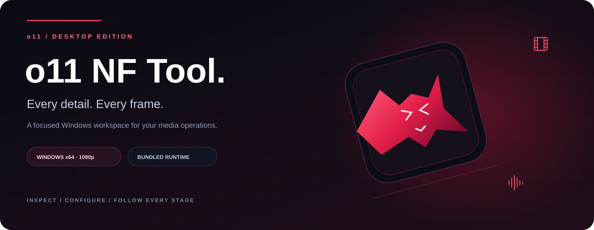
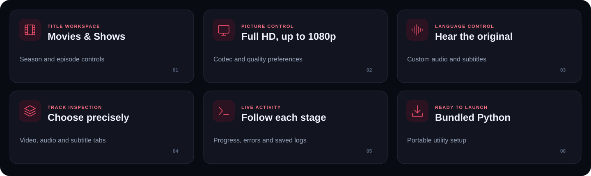
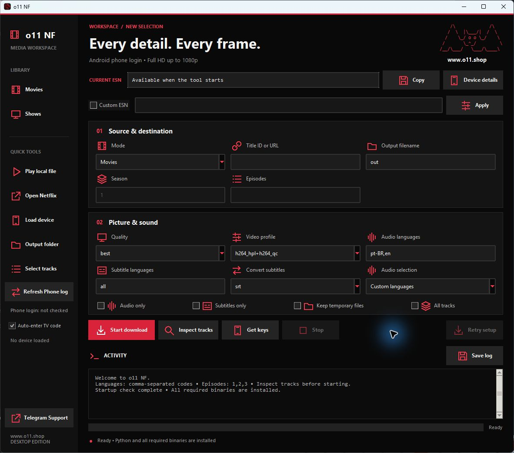
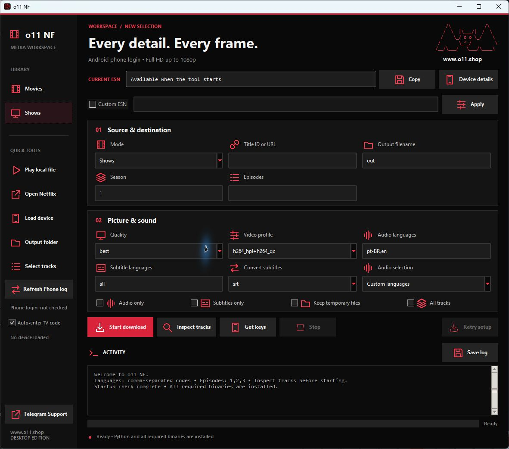
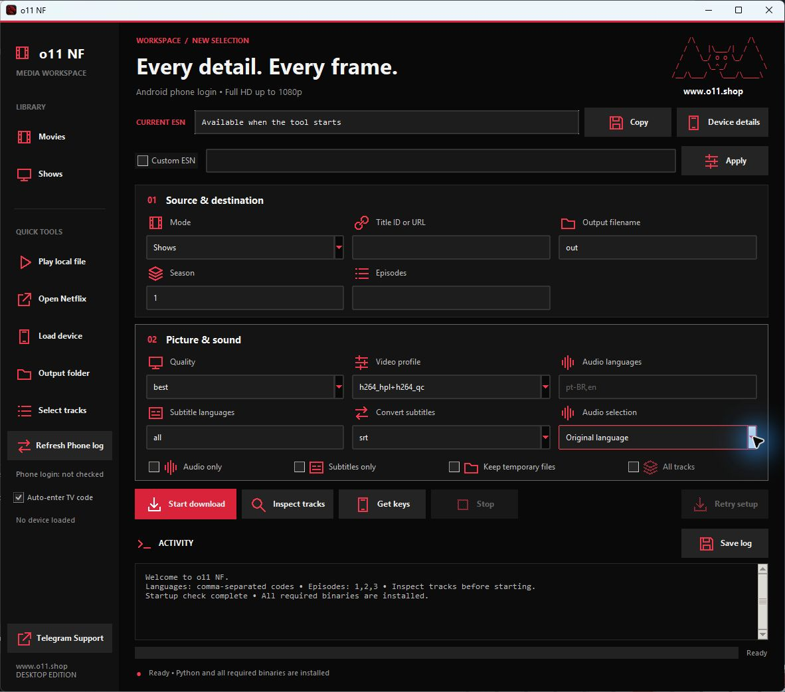
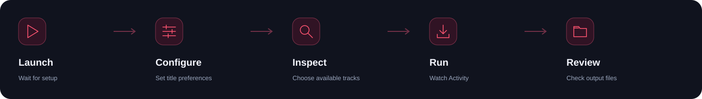

<div align="center">



**The Windows desktop media workspace. Designed for clarity at every stage.**

[](https://github.com/drmforall/o11-nf-tool/releases/latest)

[Screenshots](#screenshots) · [Complete function guide](#complete-function-guide) · [Installation](#installation) · [Troubleshooting](#troubleshooting) · [Support](#support)

**Windows x64** &nbsp; / &nbsp; **Bundled Python** &nbsp; / &nbsp; **Full HD up to 1080p**

</div>



o11 NF Tool brings title selection, track inspection, language preferences, progress, and local playback into one black-and-crimson desktop interface. This repository distributes the **Windows executable, user guide, and documentation artwork**. Application source and account sessions are excluded. Owner-supplied WVD files are stored separately in the private repository's `devices/` folder; they are not included in the downloadable EXE release.

The current backend uses Android phone authentication. The historical TV wording on the activation checkbox refers to the browser code-entry page, not a switch to Android TV authentication. Quality is capped at **1920 × 1080**. Service acceptance and available tracks depend on your account, device setup, title, and the service response.

## Screenshots


These are actual captures of the final executable running in an isolated local workspace with no device credentials loaded. They show the interface and local startup readiness; they do not demonstrate a successful live service operation.

### Main workspace

The sidebar keeps library modes and quick tools within reach. The central workspace groups source inputs, encoding preferences, operation controls, and Activity.



<details>
<summary><strong>View Shows mode — season and episode selection</strong></summary>

Shows mode enables Season and Episodes. Movies mode disables those inputs. Leave Episodes empty to use the selected season's default behavior, or enter comma-separated episode numbers to narrow the selection.



</details>

<details>
<summary><strong>View Original language — automatic audio preference</strong></summary>

Original language disables custom Audio languages and All tracks, keeping audio selection tied to the manifest's original-language designation.



</details>

## Complete function guide


### Source & destination

| Icon | Function | How it behaves |
| :---: | :--- | :--- |
|  | **Movies** | Selects movie mode from the sidebar or Mode menu. Season and Episodes are disabled. |
|  | **Shows** | Enables season and episode inputs for episodic titles. |
|  | **Mode** | Mirrors the Movies / Shows sidebar selection. Changing either control updates the same setting. |
|  | **Title ID or URL** | Accepts a numeric title ID or supported title URL. Invalid input produces a validation error before an operation starts. |
|  | **Output filename** | Names the output. The default is `out`. It does not change the destination folder. |
|  | **Season** | Available in Shows mode. The initial value is `1`. |
|  | **Episodes** | Optional comma-separated numbers, for example `1,2,3`. Available in Shows mode. |

The destination is controlled by `OUTPUT_FOLDER` in the application's local configuration. **Output folder** opens that location. Title inputs and filename preferences are separate from account/session setup.


### Picture & sound

| Icon | Function | Available behavior |
| :---: | :--- | :--- |
|  | **Quality** | `best`, `1080p`, `720p`, `sd`, `sd-main`, or `sd-baseline`. `best` picks the best available stream within the Full HD cap. |
|  | **Video profile** | Preferences include `h264_hpl+h264_qc`, `h265_sdr`, `h265_hdr`, `h265_dv`, `av1_sdr`, and `av1_hdr`. Availability is determined by the source; menu entries are not a guarantee. |
|  | **Audio languages** | Comma-separated language codes. The initial setting is `pt-BR,en`. Used when Audio selection is Custom languages. |
|  | **Audio selection** | Custom languages uses your language list. Original language uses the manifest's original-language designation and reports an error if that language is unavailable. |
|  | **Subtitle languages** | Language preferences; the initial value is `all`. Actual subtitles depend on the inspected title. |
|  | **Convert subtitles** | `srt`, `ass`, or `none`. `none` disables conversion. |

### Track and file options

| Option | Effect | Practical detail |
| :--- | :--- | :--- |
| **Audio only** | Requests an audio-only operation | Video is not the requested output. |
| **Subtitles only** | Requests subtitle output | Availability depends on the title and preferences. |
| **Keep temporary files** | Skips normal cleanup | Intermediate files can consume substantial space. |
| **All tracks** | Requests the backend's all-track selection mode | Disabled and cleared when Original language is selected. |

Audio only and Subtitles only cannot be enabled together; the app reports a validation error. Choose the appropriate mode for the output you need.


### Main operation controls

| Icon | Control | Purpose and state |
| :---: | :--- | :--- |
|  | **Start download** | Starts the selected operation after setup and validation. Only one process runs at a time. **Ctrl+Enter** is the keyboard shortcut. |
|  | **Inspect tracks** | Requests title/episode track information and opens the selection panel when a catalog is received. |
|  | **Get keys** | Invokes the existing license-results mode separately from media downloads. The results panel shows title, name, quality, codec, and returned pairs, removes duplicate rows, and provides Copy selected. Treat results as private. This guide does not describe extraction or protection-bypass procedures. |
|  | **Stop** | Terminates the active process tree on Windows. Disabled while idle. Wait for exit before restarting; partial files may remain. |
|  | **Retry setup** | Rechecks and installs missing utilities after a setup failure. Available when setup needs recovery. |

### Track-selection panel

The panel has **Video**, **Audio**, and **Subtitles** tabs, each showing the received track count. Horizontal and vertical scrollbars make longer descriptions accessible.

- **Video:** select exactly one track.
- **Audio:** use Ctrl+click to select multiple rows. An empty selection skips audio.
- **Subtitles:** use Ctrl+click to select multiple rows. An empty selection skips subtitles.
- **Download selected:** applies the selection to the exact displayed title or episode after inspection finishes. One episode's selected track IDs are not applied to a whole season.
- **Close:** closes the panel.
- **Select tracks** in the sidebar reopens the catalog, or starts inspection when no usable catalog is available.

The backend compares a catalog fingerprint before applying selected track IDs. Inspect again if the catalog changes. Device and ESN changes also clear previous selection state.


### Device and identity controls

| Icon | Function | Meaning |
| :---: | :--- | :--- |
|  | **Load device** | Opens a local file-selection dialog for supported configuration. Existing destination files require confirmation before replacement; originals are preserved. Loading is blocked during an active run. |
|  | **Device details** | Shows local validation and readable device information, plus service status from the latest relevant run. Local checks do not establish service compatibility, revocation, or key/certificate matching. |
|  | **Current ESN** | Shows a locally generated preview where available, then the exact value reported by the active tool. |
|  | **Copy** | Copies the displayed ESN to the clipboard. Keep identifiers out of public logs and screenshots. |
|  | **Custom ESN** | Enables custom local entry. Disabled means the loaded device's generated value is used. |
|  | **Apply** | Validates and saves the setting. Changes are blocked during an active run and mark authentication for refresh. Input format validation does not establish service acceptance. |

The application supports its raw local device files or Android WVD containers in version 1 or 2. Declared security level is preserved; importing does not upgrade a device. Chrome-type WVD containers are rejected by the current Android-session implementation. Optional local metadata can accompany supported imports.

After a successful import, the app invalidates previous track selections and starts fresh authentication. Previous tool cookies and the configured session cache are cleared during that flow. If refresh fails or is stopped, a pending marker remains for later retry. Browser account sign-in is separate from the tool's session cache.

### Session and activation controls

**Refresh Phone login** starts an authentication-only run without requiring a title. It is disabled during setup or another active operation. The sidebar reports preparation, waiting for activation, success, and failure. Authentication success is separate from title license validation.

**Auto-enter TV code** enables browser submission of a printed activation code through the service's TV code-entry page. The backend remains the Android phone flow. A dedicated local browser profile allows sign-in to persist. Repeated messages for the same code are ignored; a changed code triggers a fresh submission attempt. Complete account login and additional confirmations yourself. Activity reports browser failures and a manual fallback.

**Device files present / No device loaded** reports local file presence. **Service status** starts unchecked, can report a successful title license response, and reports revocation only when an explicit revocation message is returned. A generic request failure does not establish revocation.

### Use the devices in the repository

> **Device setup:** Use a device file available in the repository's [devices folder](devices/) with the app's **Load device** control. Download your selected `.wvd` file to your PC, open **Load device**, and select that file. Load one device at a time; the app then prepares a fresh authentication session.

| Available device | File |
| :--- | :--- |
| Haier Android TV | [Haier WVD](devices/haier_haier_android_tv_ff_pro_17.0.0_d6fcadf2_20446_l1_20261005_120723.wvd) |
| Vestel Android TV | [Vestel WVD](devices/vestel_android_tv_15.0.0_3acd8dbb_22402_l1_20261005_113102%20%282%29.wvd) |

These owner-supplied WVD files contain device credentials and a private key. They are stored in the private repository, are not release assets or bundled into the EXE, and have not been tested for live service acceptance. Use only devices you are authorized to use; repository access does not grant redistribution rights.


### Activity, progress, and logs

| Element | What it tells you |
| :--- | :--- |
| **Activity panel** | Setup messages, tool output, changes, and errors. The view follows newly appended output. |
| **Save log** | Saves current Activity text to a chosen `.txt` file. Sanitize it before sharing. |
| **Red progress bar** | Reported transfer or muxing percentages for the current stage. |
| **Animated progress** | An active stage with no numerical percentage. |
| **Progress label** | The reported phase, such as setup, transfer, title batch, or muxing. |
| **Footer status** | Local readiness and operation state. |

Progress may restart between files or stages; it is not an estimated overall percentage. Click the bar to focus the latest Activity messages. **Complete** indicates successful process exit; check expected output. **Stopped or failed** means review the log.

### Sidebar quick tools

| Icon | Control | Behavior |
| :---: | :--- | :--- |
|  | **Play local file** | Opens a local media picker and launches the selected file through its default Windows application. |
|  | **Open Netflix** | Opens the entered title in the default browser. Requires valid title input. |
|  | **Output folder** | Opens the local `OUTPUT_FOLDER` destination, creating it if needed. |
|  | **Select tracks** | Opens the inspected catalog or starts inspection when needed. |
|  | **Telegram Support** | Opens the support link configured in the application through your browser. |

Closing the application during an active operation asks whether to stop the run and close. Cancel leaves the application running.

## Installation




### Choose your Windows package

| Package | Download | Purpose |
| :--- | :--- | :--- |
| **Standalone EXE** | [Windows x64 EXE](https://github.com/drmforall/o11-nf-tool/releases/download/v1.0.1/o11-NF-Tool-1.0.1-windows-x64.exe) | One file, no install wizard |
| **Folder bundle / portable ZIP** | [Windows x64 ZIP](https://github.com/drmforall/o11-nf-tool/releases/download/v1.0.1/o11-NF-Tool-1.0.1-windows-x64-portable.zip) | Extract the entire folder, then run `o11 NF.exe` |
| **Installer** | [Windows x64 Setup](https://github.com/drmforall/o11-nf-tool/releases/download/v1.0.1/o11-NF-Tool-1.0.1-windows-x64-setup.exe) | Per-user install, shortcuts, and uninstall support |

All three formats package the same x64 application. **Windows 11 x64 passed local packaging checks.** Windows 10 x64 and Windows 11 ARM64 through x64 emulation remain untested; current browser automation's upstream requirements start at Windows 11. Windows 8.1 and older, 32-bit systems, and native ARM64 are not supported by these builds. See the [complete Windows compatibility and package guide](WINDOWS-BUILDS.md).

The ZIP needs no install wizard, but its application data still normally uses `%LOCALAPPDATA%\o11NFTool`. Keep `_internal` beside its executable.

### First launch

1. Open [Latest release](https://github.com/drmforall/o11-nf-tool/releases/latest).
2. Choose the standalone **o11-NF-Tool-1.0.1-windows-x64.exe**, ZIP, or Setup package from the table above. The root repository still contains the standalone copy named `o11 NF.exe`.
3. Save to a writable Windows x64 folder and close older running copies.
4. Launch the executable and wait for startup checks.
5. Read Activity. Resolve reported errors and use Retry setup if needed.
6. Configure your own required local account/device setup before online operations.

Python and packages are bundled; a separate Python install is unnecessary. Missing utilities are installed locally and require internet access. Existing utilities are reused when present.

| Requirement | Detail |
| :--- | :--- |
| Operating system | Windows x64 |
| Runtime | Bundled Python and application packages |
| Internet | Required for missing utilities and online operations |
| Storage | Room for runtime files, utilities, intermediates, and output |
| Account/device | Applicable local setup; not included in the EXE release |

No measured minimum RAM or exact storage benchmark is declared for this build.

### Local data and updates

The standalone executable deploys runtime files to:

```text
%LOCALAPPDATA%\o11NFTool
```

Paste the path into File Explorer to locate its files. An executable beside an existing source workspace can use that workspace instead.

| Local item | Purpose |
| :--- | :--- |
| `nftool_cfg.py` | Application defaults and output destination |
| `binaries/` | Portable utilities |
| `cookies/` | Tool account/session state |
| `.netflix-browser/` | Dedicated browser profile |
| `.ui-esn.json` | Saved custom ESN setting |
| `pywidevine/cdm/devices/` | Local device configuration |
| `temp/`, `output/` | Intermediate and completed files |

To update, close the app, download the newer EXE, and run it. The launcher preserves an existing `nftool_cfg.py`. Keep local identities and sessions private. The release includes neither saved sessions nor device material.

### Verify the executable

| Release detail | Value |
| :--- | :--- |
| Version | **v1.0.1** — Windows packaging release |
| Publication date | **6 October 2026** |
| Standalone EXE size | **66,846,564 bytes** |
| Download | [GitHub Release](https://github.com/drmforall/o11-nf-tool/releases/tag/v1.0.1) |
| All package checksums | [SHA256SUMS.txt](https://github.com/drmforall/o11-nf-tool/releases/download/v1.0.1/SHA256SUMS.txt) |

**SHA-256**

```text
F306CDF321EF9D829C2B7751192B8050E4D159DD83259B11C356DF7AFB754E38
```

```powershell
Get-FileHash -LiteralPath '.\o11-NF-Tool-1.0.1-windows-x64.exe' -Algorithm SHA256
```

The digest above identifies the standalone EXE; use SHA256SUMS.txt for ZIP and Setup checksums. It is not a signing or security-certification claim. Packaged self-tests passed for the standalone, folder, extracted ZIP, and installed runtime on the available Windows 11 host. Installer installation and uninstall were checked in an isolated test directory. Live service acceptance and other Windows configurations remain unverified.

## Troubleshooting


| Symptom | Suggested check |
| :--- | :--- |
| Startup setup fails | Read the first Activity error, check connectivity and space, then Retry setup. |
| Old name/icon appears | Check EXE and shortcut paths; Explorer may cache icons. |
| Python installer error appears | Confirm you launched this bundled release rather than an older bootstrap. |
| Start/Inspect is disabled | Wait for setup or the active operation to finish. |
| Season/Episodes are disabled | Switch Mode to Shows. |
| Audio languages/All tracks are disabled | Original language is selected; choose Custom languages to restore them. |
| Original audio is unavailable | The source did not identify a matching track; review Activity and preferences. |
| Track IDs no longer match | Inspect again after a catalog, title, device, or identity change. |
| Progress has no number | The stage may not expose numerical progress. |
| Output folder is empty | Check completion and the destination setting. |
| Service rejects a session | Review the response and your account/device setup. Installation success does not imply authorization. |
| Browser activation fails | Read Activity and complete account login or confirmations yourself. |
| Local playback fails | Confirm the file exists and try another compatible player. |

## Support

Report reproducible issues through [GitHub Issues](https://github.com/drmforall/o11-nf-tool/issues). Include Windows and release versions, the action taken, reproduction steps, and sanitized error text. The app also exposes its configured Telegram Support link.

Remove passwords, cookies, tokens, private keys, device blobs, ESNs, and session identifiers before sharing logs or screenshots.

This repository and its releases remain **private**; downloads require owner-granted access. No project-wide redistribution license has been declared. Bundled components and utilities may have separate terms. Use the application only for content and systems you are authorized to access.

<div align="center">

**o11 NF Tool · Desktop Edition**

[Download](https://github.com/drmforall/o11-nf-tool/releases/latest) · [Function guide](#complete-function-guide) · [Report an issue](https://github.com/drmforall/o11-nf-tool/issues)

</div>
